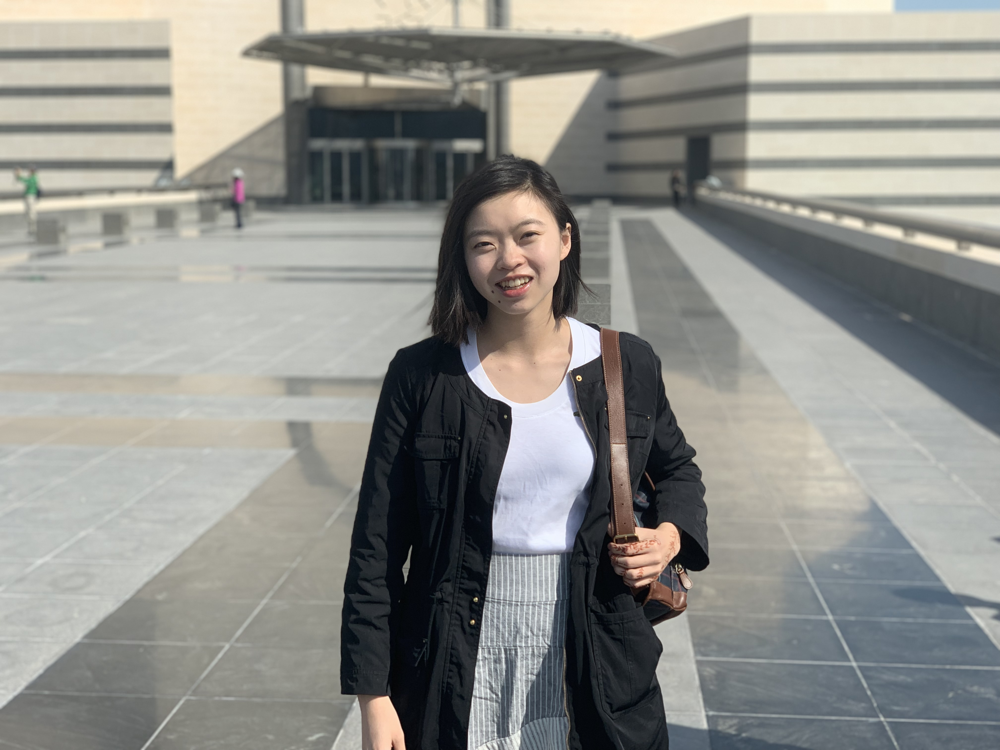

|   |   |   |
|---|---|---|
|  **Jessica Lee**  |  **Husni Almoubayyed**  |  **Tony Wang**  |
|  President of DSC  |  VP of Projects  |  VP of Finance  |
| I am a sophomore in SCS studying Computer Science. Outside of DSC, I’m working on computer vision research, trying to cook new meals, or reading or listening to Tech News.  | I am a PhD student working in cosmology. I am passionate about artificial intelligence, quantitative finance, and solving social problems with interesting data. I enjoy playing piano, and rarely say no to a trip, having been to over a hundred cities in 20 countries.  | My name is Tony Wang and I am a sophomore studying Computational Finance with an additional major in Statistics and Machine Learning. I am passionate about how we can leverage data science skills to gain insights from data and how these insights can guide us to make better decisions. In my spare time, I love music. And traveling  |
